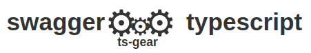
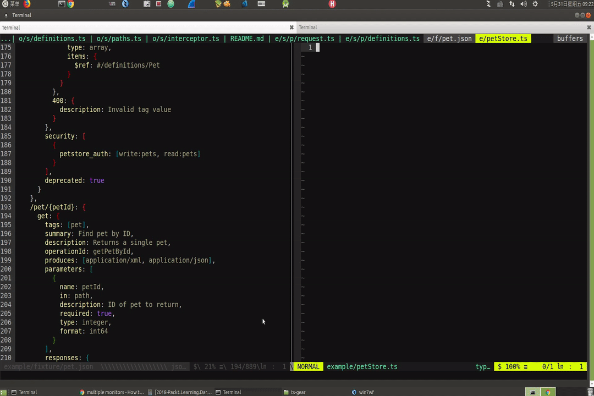

# ts-gear

## 用途

自动从swagger生成ts类，与请求接口的函数

方便的感知后端接口定义的变化。

## [English Doc](./README.md)

## 起源

inspired by [pont](https://github.com/alibaba/pont)，pont是法语，桥。
编程用英语，所以还是自己起了个`ts-gear`的英文名，ts是typescript与swagger的组合，gear寓意通过这个工具像齿轮一样，将前后端紧密的结合在一起，构成一架严密运转的机器。



## 用法

### install

```bash
yarn add ts-gear -D
// or
npm install ts-gear -D
```

## 运行

先在项目根目录下生成配置文件`ts-gear.js`或`ts-gear.ts`，推荐使用`ts`。

[关于配置文件格式选型](https://wangfan.bj.cn/?p=1476)

javascript example

```javascript
const config = {
  // 生成swagger配置ts文件的目录
  dest: './service',
  // projects是项目的数组
  projects: [
    {
      // 每个项目的英文名，在dest指定的文件夹内会生成该项目名对应的文件夹
      // 必须使用合法的路径名
      name: 'pet',
      // source可以是本地文件或swagger doc的接口(以http开头)
      source: '__tests__/fixture/pet.json',
      // pathMatcher可以是正则或一个以url为参数返回bool值的函数，当为正则时，只生成匹配该正则的请求函数; 当是函数时，之生成返回为true的请求函数
      pathMatcher: /^\/api/, // 只生成以/api开头的路径，如果不需要过滤则删除该项
    },
    {
      name: 'projectA',
      source: 'http://192.168.1.111/v2/api-docs',
      // fetchOption 是可选项，如果swagger接口有一些验证需求，
      // 可以按原生fetch可接收的参数配置
      // 如果验证很麻烦最好还是在浏览器上把swagger文档copy到一个本地json文件方便，只是做不到即时更新了。
      pathMatcher: url => url.startsWith('/api'), // 只生成以/api开头的路径，如果不需要过滤则删除该项
      fetchOption: {
        header: {
          Authorization: 'your token ...',
          ...
        }
        ...
      }
    },
  ],
}

module.exports = config
```

typescript example

```typescript
import { IUserConfig } from 'ts-gear/bin/interface'

const config: IUserConfig = {
  // 生成swagger配置ts文件的目录
  dest: './service',
  // projects是项目的数组
  projects: [
    {
      // 每个项目的英文名，在dest指定的文件夹内会生成该项目名对应的文件夹
      // 必须使用合法的路径名
      name: 'pet',
      // source可以是本地文件或swagger doc的接口(以http开头)
      source: '__tests__/fixture/pet.json',
      // pathMatcher可以是正则或一个以url为参数返回bool值的函数，当为正则时，只生成匹配该正则的请求函数; 当是函数时，之生成返回为true的请求函数
      pathMatcher: /^\/api/, // 只生成以/api开头的路径，如果不需要过滤则删除该项
    },
    {
      name: 'projectA',
      source: 'http://192.168.1.111/v2/api-docs',
      // fetchOption 是可选项，如果swagger接口有一些验证需求，
      // 可以按原生fetch可接收的参数配置
      // 如果验证很麻烦最好还是在浏览器上把swagger文档copy到一个本地json文件方便，只是做不到即时更新了。
      pathMatcher: url => url.startsWith('/api'), // 只生成以/api开头的路径，如果不需要过滤则删除该项
      fetchOption: {
        header: {
          Authorization: 'your token ...',
          ...
        }
        ...
      }
    },
  ],
}
```

export default config

执行

```bash
npx tsg // 如果tsg名称被占用，用npx ts-gear
// 或
yarn tsg
// 如果只想更新某个项目，可使用-p参数指定项目名称
npx tsg -p pet
```

以上面的配置文件为例子
会生成如下文件结构
可参照example文件夹

```bash
▾ service/
  ▾ pet/
      definitions.ts
      fetchInterceptor.ts
      request.ts
  ▾ projectA/
      definitions.ts
      fetchInterceptor.ts
      request.ts
```

* `definitions.ts`文件是所有`swagger schema`中的definitions部分生成，所有基础类型。

* `request.ts`是根据`swagger schema`中的paths生成的所有方法，方法名生成规则为 `http请求方法 + api路径`的驼峰格式，例如

```javascript
  "paths": {
    "/pet": {
      "post": {
      ...
      },
    },
    // 生成postPet 方法
    "/pet/findByTags": {
      "get": {
      ...
      },
    },
    // 生成getPetFindByTags方法
    "/pet/{petId}": {
      "get": {
      ...
      },
    },
    // 生成getPetPetId方法
```

  每个生成的方法中的参数与返回的值都从swagger定义生成对应的类型。



### 项目中使用

以上面的配置文件生成的文件为例

```javascript
import { getPetPetId } from 'service/pet'

getPetPetId({
  path: {
    petId: 1
  }
}).then(pet => {
  console.log(pet)
  // pet 是Pet的实例，可以校验Pet的所有属性
})
```

如果您已经习惯与使用一些第三方请求工具，例如`axios`，您可以不使用`request.ts`，仅仅引入`definitions.ts`来校验接口返回的数据类型。

#### 使用mockRequest.ts

在生成`request.ts`文件的同时，也会生成一个`mockRequest.ts`文件，

其api接口与`request.ts`一致，但所有会返回内容的请求都会直接返回根据swagger接口数据结构的mock数据，可在开发初期加速开发速度。

在服务端没有提供实际数据时开发，引入`mockRequest`提供的方法。

```typescript
import { getPetPetId } from 'service/pet/mockRequest'
```

当服务端准备好联调数据后，切换到`request.ts`。

```typescript
import { getPetPetId } from 'service/pet/request'
```

在mockRequest文件中，会检测编译环境，阻止`process.env.NODE_ENV === 'production'`时的编译。

* 🔧 `interceptor.ts`是从`ts-gear`项目的模板copy来的，被对应的`request.ts`中的所有请求方法调用。

  其中的`interceptRequest`被所有请求之前调用，`interceptResponse`在所有请求成功之后处理数据用。

  这个文件在第一次生成项目类型时从`ts-gear`中复制一份，之后不会再覆盖，如果每个项目有特殊的请求前后需要处理的逻辑可以在该文件中添加。

## 开发过程 develop steps

* 从pont获得了从swagger的schema生成ts文件的想法。

* 最开始想增强pont拿来就用，在看pont源码的过程中感觉有些pont里的源码理解不了，应该是没有遇到pont作者当时遇到的schema结构大概是理解不了的，就全重写了。

* 使用[ts-morph](https://dsherret.github.io/ts-morph)简单的解析了一下ts语法。

* [更多](./DEV.md)

## 修订与反馈 Errata And Feedback

我只是将我遇到的几个项目的swagger文档、swagger ui官方的pet例子，还有参考了一些swagger schema官方文档做为样例开发了这个程序。肯定有一些没有考虑到的情况。如果有可以改进或解析错误的情况，欢迎将不能解析的schema提issue。

## TODO

* 将`ReplyVO«ConfigVO»`转换成泛型的格式`ReplyVO<ConfigVO>`，是一个优化点，可以使数据结构更优雅更有关联性，但暂时没有也可以用。

* 处理`oneOf, allOf, anyOf, not`里可能有的`discriminator`情况。

* 添加`responses`中200之外的其它表示错误的类型，添加到`fetch.then<T1, T2>，T2`的位置上。
